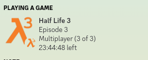

# Half Life 3 Rich Presence
An application to troll all your friends and make them believe HL3 has released.

## Building & Usage
1. Clone the repo (duh)
2. Run `mvn install` in the directory where you cloned the repo
3. Run the `target/HL3 Rich Presence.jar` file as you would any other Java application (usually through double-clicking or `java -jar target/HL3 Rich Presence.jar`)
4. Have Discord open
5. Enjoy :)

## Dependencies
This project only depends on [Vatuu/discord-rpc](https://github.com/Vatuu/discord-rpc).

# 
# 
# 

## HL3RP in action

